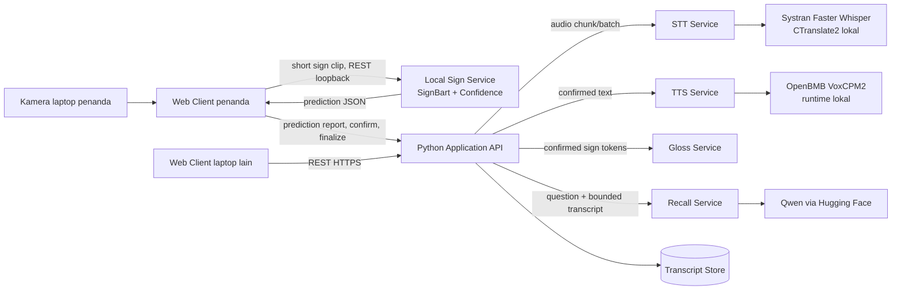

# Isyara AI Services — Design and API Contract

Status: Draft v0.3
Target: MVP Hackathon IFEST 2026  
Audience: tim software engineering dan tim AI  
Bahasa demo awal: Inggris

Dokumen terkait:

- `isyara-ai-services-openapi.yaml`: kontrak HTTP AI services, termasuk pengecualian Sign Service edge-local;
- `isyara-application-server-design.md`: orchestration, state, dan persistence Application Server;
- `isyara-application-server-openapi.yaml`: kontrak REST publik untuk frontend.

Dokumen ini tetap menjadi sumber kebenaran batas AI service. OpenAPI menjadi sumber kebenaran bentuk request/response yang dapat dibaca mesin.

## 1. Tujuan

Dokumen ini menetapkan batas tanggung jawab, kontrak data, fungsi inti, API, alur real-time, kebijakan timeout, dan perilaku kegagalan untuk layanan AI Isyara.

Prinsip utamanya:

- Web client berkomunikasi dengan Application API untuk state bersama dan dengan Sign Service melalui loopback pada laptop penanda.
- Token Hugging Face hanya berada di server.
- Application API menjadi sumber kebenaran untuk session, utterance, dan transcript.
- Layanan AI dibuat stateless sejauh memungkinkan.
- Model dan provider dipilih melalui konfigurasi, bukan di-hardcode dalam UI.
- Hanya transcript final dan token sign yang telah dikonfirmasi yang boleh menjadi sumber Conversation Recall.
- Recall harus menampilkan evidence atau menyatakan bahwa informasi tidak ditemukan.

## 2. Keputusan Arsitektur

### 2.1 Batas repository dan deployment

| Komponen | Pemilik | Lokasi eksekusi | Tanggung jawab |
|---|---|---|---|
| Web Client | repo software engineering | browser | kamera, mikrofon, UI caption, konfirmasi sign, kontrol session, Recall |
| Application API | repo software engineering | server aplikasi | session, transcript store, orkestrasi, autentikasi, kontrak publik |
| STT Service | repo AI services | server AI | Faster Whisper/CTranslate2 lokal, chunking, hasil provisional/final |
| TTS Service | repo AI services | server AI | VoxCPM2 lokal, encoding audio hasil sintesis |
| Recall Service | repo AI services | server AI | prompt Qwen, keluaran terstruktur, validasi awal |
| Gloss Service | repo AI services | server AI | merapikan rangkaian token sign menjadi teks; bukan Conversation Recall |
| Sign Service | repo AI/sign terpisah | laptop RTX 3060 | SignBart, inferensi isolated sign, top-k, status confidence |

Sign Service lokal hanya bind ke `127.0.0.1` pada laptop penanda dan dipanggil langsung oleh web client pada laptop tersebut. Video sign tidak pernah melewati Application API. STT, TTS, Recall, dan Gloss dapat berada dalam satu proses FastAPI untuk demo, tetapi harus tetap dipisahkan sebagai modul dan router agar dapat dipecah menjadi deployment terpisah tanpa mengubah kontrak.

### 2.2 Diagram komponen



### 2.3 Source of truth

Application API menyimpan:

- metadata session;
- transcript final dari STT;
- token sign yang telah dikonfirmasi;
- utterance sign yang telah difinalisasi;
- pertanyaan dan hasil Recall bila diperlukan untuk UI session;
- timestamp dan source setiap entry.

AI services tidak menyimpan riwayat meeting. Recall Service menerima konteks eksplisit pada setiap request. Konsekuensinya, retry bersifat aman, debugging lebih mudah, dan tidak ada sinkronisasi session tersembunyi antar-repo.

## 3. Alur Utama

### 3.1 Speech-to-Text

```text
Frontend          Application API        STT Service          HF ASR
   | audio chunk         |                    |                  |
   |-------------------->| POST chunk         |                  |
   |                     |------------------->| rolling decode   |
   |                     |                    |----------------->|
   |                     | provisional text  |<-----------------|
   | partial caption     |<-------------------|                  |
   |<--------------------|                    |                  |
   | final chunk/commit  |------------------->| final decode     |
   |                     | final transcript  |<-----------------|
   |                     |<-------------------|                  |
   |                     | persist final      |                  |
   | final caption       |                    |                  |
   |<--------------------|                    |                  |
```

Catatan penting: `faster-whisper` memproses satu audio buffer pada setiap pemanggilan `transcribe`. Karena itu, `partial` pada MVP adalah hasil **provisional** dari rolling chunk yang diorkestrasi melalui REST, bukan token streaming native dari model. Partial boleh berubah dan tidak disimpan. Hanya event `final` yang masuk Transcript Store.

Konfigurasi awal untuk demo:

- PCM signed 16-bit little-endian, mono, 16 kHz;
- rolling chunk 1.5–2 detik;
- overlap 250–400 ms;
- commit ketika tombol Stop ditekan atau voice activity timeout tercapai;
- deduplikasi overlap sebelum final disimpan.

### 3.2 Sign-to-Text per utterance

```text
1. Frontend memanggil Create Utterance pada Application API.
2. Frontend merekam satu klip pendek yang berisi satu isolated sign.
3. Frontend mengunggah klip langsung ke Sign Service melalui `http://127.0.0.1:8765`.
4. Sign Service menjalankan SignBart dan mengembalikan top-k, confidence, status, dan latency.
5. Frontend menampilkan prediction dan melaporkan metadata prediction ke Application API sebagai JSON; video tidak ikut dikirim.
6. Application API memvalidasi dan menyimpan prediction sementara, bukan sebagai transcript.
7. Untuk CONFIDENT, UI menawarkan Accept; untuk AMBIGUOUS, UI wajib meminta pilihan.
8. Setelah pengguna mengonfirmasi, frontend mengirim confirmed token ke Application API.
9. Token langsung ditampilkan sebagai live sign transcript.
10. Web client lain dapat membaca token terkonfirmasi dari utterance aktif melalui polling REST.
11. Langkah 2–10 diulang untuk kata berikutnya.
12. Saat Stop Sign ditekan, frontend meminta Application API memfinalisasi utterance.
13. Application API mengirim seluruh confirmed token pada range tersebut ke Gloss Service.
14. Teks hasil normalisasi disimpan sebagai satu transcript entry dengan source=sign.
15. Teks final dapat dikirim ke TTS Service hanya setelah pengguna memilih Speak.
```

`prediction` bukan transcript. Hanya token berstatus `confirmed` yang boleh dikirim ke Gloss Service, TTS, atau Recall. Untuk model word-level, satu request prediksi harus merepresentasikan satu klip sign; pengiriman frame tunggal berulang melalui REST tidak menjadi bagian kontrak MVP.

### 3.3 Conversation Recall dengan Qwen via Hugging Face

```text
Frontend         Application API       Transcript Store      Recall Service       Qwen/HF
   | question           |                      |                    |                 |
   |------------------->| load bounded range   |                    |                 |
   |                    |--------------------->|                    |                 |
   |                    | normalized entries   |                    |                 |
   |                    |<---------------------|                    |                 |
   |                    | question + context entries              |                 |
   |                    |------------------------------------------>| chat completion |
   |                    |                                           |--------------->|
   |                    |                                           | structured JSON|
   |                    |                                           |<---------------|
   |                    | answer + evidence                          |                 |
   |                    |<------------------------------------------|                 |
   |                    | validate evidence IDs and quotes          |                 |
   | answer + evidence  |                                           |                 |
   |<-------------------|                                           |                 |
```

Kata-kata yang dikirim ke Qwen bukan daftar lepas tanpa asal. Application API mengirim `contextEntries` yang sudah dikelompokkan sebagai transcript final, diurutkan berdasarkan waktu, dan dilengkapi `entryId`, `source`, `speaker`, serta timestamp. Token sign dalam utterance baru masuk konteks setelah dikonfirmasi dan difinalisasi.

Untuk MVP, Application API memilih konteks dengan urutan berikut:

1. range yang dipilih pengguna, jika ada;
2. lima menit terakhir sebelum pertanyaan;
3. potong entry tertua jika melebihi batas karakter/token;
4. pertahankan entry secara utuh agar evidence dapat diverifikasi.

Tidak diperlukan vector database untuk demo. Jika pertanyaan meminta “dua menit terakhir”, Application API menangani pemilihan waktu; Qwen hanya merangkum konteks terpilih.

## 4. Kontrak HTTP Internal

Semua endpoint AI menggunakan prefix `/v1`. STT, TTS, Gloss, dan Recall merupakan kontrak internal Application API. Endpoint Sign merupakan kontrak edge-local antara web client penanda dan Sign Service. Spesifikasi mesin terdapat di `isyara-ai-services-openapi.yaml`.

### 4.1 Header umum

| Header | Wajib | Keterangan |
|---|---:|---|
| `X-Internal-API-Key` | ya untuk antarlayanan nonlokal; tidak untuk Sign browser-local | autentikasi antarlayanan; jangan ditanam di frontend |
| `X-Request-ID` | ya untuk pemanggil internal | UUID untuk korelasi log; service membuat UUID fallback bila tidak ada atau tidak valid |
| `Idempotency-Key` | untuk TTS/Recall | mencegah pemrosesan ulang akibat retry |
| `Content-Type` | ya | JSON, multipart, atau tipe audio yang sesuai |

HF token tidak pernah diteruskan dari frontend atau Application API dalam request. Token dibaca oleh masing-masing service dari secret environment.

### 4.2 Sign prediction — `POST /v1/sign/predict`

Input: `multipart/form-data` berisi satu klip isolated sign.

```text
video: binary
topK: 3
vocabularyVersion: mvp-en-v1
```

Response `200`:

```json
{
  "requestId": "c946f42d-474e-40f4-a6d9-b0eb75f05a9a",
  "predictionId": "pred_01J8Y7RK2F",
  "prediction": "REPEAT",
  "confidence": 0.86,
  "candidates": [
    {"label": "REPEAT", "confidence": 0.86},
    {"label": "AGAIN", "confidence": 0.09},
    {"label": "UNDERSTAND", "confidence": 0.03}
  ],
  "status": "CONFIDENT",
  "requiresConfirmation": false,
  "modelVersion": "signbart-mvp-v1",
  "vocabularyVersion": "mvp-en-v1",
  "latencyMs": 184
}
```

Sign Service bersifat stateless: service tidak membuat session, utterance, atau transcript. Web client melaporkan response ini ke Application API sebagai JSON. Application API menyimpan hubungan antara `predictionId`, `utteranceId`, dan hasil konfirmasi pengguna. `requestId` dari Sign Service dilaporkan sebagai `localRequestId`; request publik Application API menggunakan `X-Request-ID` yang berbeda.

### 4.3 STT — `POST /v1/stt/transcriptions`

Input: `multipart/form-data` dengan file audio dan metadata.

```text
audio: binary
language: en
encoding: wav | webm | flac
timestamps: true
```

Response `200`:

```json
{
  "requestId": "8bc31d53-7dd1-46d5-ae72-d78d83aa1dcf",
  "text": "The deadline is Friday at five.",
  "language": "en",
  "segments": [
    {
      "text": "The deadline is Friday at five.",
      "startMs": 0,
      "endMs": 2140
    }
  ],
  "model": {
    "provider": "local-ctranslate2",
    "id": "Systran/faster-whisper-large-v3"
  },
  "latencyMs": 682
}
```

Endpoint batch ini juga menjadi primitive yang dipakai Application API untuk rolling audio chunk berbasis REST.

### 4.4 TTS — `POST /v1/tts/synthesize`

Request:

```json
{
  "text": "Could you repeat that, please?",
  "language": "en",
  "voice": null,
  "format": "wav"
}
```

Response `200`: body biner `audio/wav`, dengan header:

- `X-Request-ID`;
- `X-Model-ID`;
- `X-Latency-Ms`.

Teks maksimum MVP: 500 karakter. Kegagalan TTS tidak menghapus teks dan tidak menggagalkan utterance. Jika provider mengembalikan format yang berbeda, TTS Service wajib menormalisasi atau mentranskode audio ke format yang diminta sebelum mengirim response.

### 4.5 Gloss normalization — `POST /v1/gloss/normalize`

Endpoint ini merapikan confirmed sign tokens setelah Stop Sign. Endpoint ini tidak menjawab pertanyaan tentang percakapan.

Request:

```json
{
  "utteranceId": "utt_01J8Y7M2X9",
  "language": "en",
  "tokens": [
    {"id": "tok_1", "label": "I", "confirmedAt": "2026-09-18T10:15:20Z"},
    {"id": "tok_2", "label": "NOT_UNDERSTAND", "confirmedAt": "2026-09-18T10:15:22Z"}
  ]
}
```

Response:

```json
{
  "requestId": "a5de6361-aedf-4e99-961e-d3f66def3768",
  "utteranceId": "utt_01J8Y7M2X9",
  "text": "I do not understand.",
  "method": "template",
  "sourceTokenIds": ["tok_1", "tok_2"],
  "warnings": [],
  "latencyMs": 3
}
```

Untuk vocabulary 10–20 sign, gunakan rule/template deterministik terlebih dahulu. Mode LLM untuk endpoint ini boleh menjadi feature flag, tetapi tidak boleh mengubah atau menambah fakta.

### 4.6 Recall — `POST /v1/recall/query`

Request:

```json
{
  "sessionId": "ses_01J8Y6Z4Q1",
  "query": "When is the deadline?",
  "language": "en",
  "contextEntries": [
    {
      "id": "tr_17",
      "sequence": 17,
      "source": "speech",
      "speaker": "Participant",
      "text": "The submission deadline is Friday at five PM.",
      "startedAt": "2026-09-18T10:18:11Z",
      "endedAt": "2026-09-18T10:18:14Z"
    }
  ],
  "options": {
    "maxAnswerTokens": 160,
    "requireEvidence": true
  }
}
```

Response ketika ditemukan:

```json
{
  "requestId": "2ea7578d-ac07-4e49-9db4-83b4a233c13f",
  "answer": "The deadline is Friday at 5 PM.",
  "grounded": true,
  "evidence": [
    {
      "entryId": "tr_17",
      "quote": "The submission deadline is Friday at five PM.",
      "startedAt": "2026-09-18T10:18:11Z"
    }
  ],
  "notFoundReason": null,
  "model": {
    "provider": "huggingface",
    "id": "configured-qwen-model"
  },
  "latencyMs": 1180
}
```

Response ketika konteks tidak mendukung jawaban tetap menggunakan `200`:

```json
{
  "requestId": "2ea7578d-ac07-4e49-9db4-83b4a233c13f",
  "answer": "I could not find that information in the transcript.",
  "grounded": false,
  "evidence": [],
  "notFoundReason": "NOT_IN_CONTEXT",
  "model": {
    "provider": "huggingface",
    "id": "configured-qwen-model"
  },
  "latencyMs": 940
}
```

`404` tidak digunakan untuk jawaban yang tidak ditemukan karena request berhasil diproses. Kode error HTTP dipakai untuk kegagalan teknis atau request tidak valid.

## 5. Pola Transport REST

Seluruh koneksi frontend dan antarlayanan menggunakan REST pada MVP. Browser pada laptop penanda terhubung langsung ke Sign Service melalui loopback, tetapi tidak pernah terhubung langsung ke provider AI.

### 5.1 Near-real-time STT melalui REST

Frontend mengirim potongan audio berurutan ke Application API. Setiap request membawa `streamId`, `sequence`, dan `commit`. Application API meneruskan audio ke STT Service. Response sebelum commit diperlakukan sebagai partial provisional; response commit diperlakukan sebagai final dan disimpan.

Detail endpoint publik terdapat dalam `isyara-application-server-openapi.yaml`. Pemilik STT dapat mengubah cara buffering internal selama kontrak HTTP tidak berubah.

### 5.2 Word-level Sign melalui REST

Satu request `/v1/sign/predict` dari web client penanda ke service loopback berisi satu klip pendek untuk satu sign. Format video MVP yang disarankan adalah `video/webm` atau `video/mp4`, dengan batas ukuran dan durasi yang ditetapkan bersama tim frontend.

Status valid:

- `CONFIDENT`;
- `AMBIGUOUS`;
- `UNKNOWN`;
- `INVALID_INPUT`;
- `NO_SIGN`.

Sign Service tidak menentukan apakah kata telah diterima sebagai transcript. Keputusan `accept`, `choose candidate`, `retry`, atau `cancel` dilakukan di UI, lalu disimpan melalui Application API.

Sign Service menerapkan CORS allowlist untuk origin web app yang tepat. Web client memeriksa `/health/ready` sebelum mengaktifkan kamera. Untuk demo, origin HTTP/jaringan tepercaya atau solusi loopback yang kompatibel dengan browser harus diuji terlebih dahulu; produksi HTTPS dapat memerlukan companion HTTPS lokal atau ekstensi browser.

### 5.3 Konsekuensi latency

- Jangan mengirim satu HTTP request per frame.
- Rekam satu klip 1–2 detik per kata, lalu unggah satu kali.
- Video dikirim langsung ke loopback sehingga tidak mengalami hop jaringan melalui Application API.
- Muat model SignBart saat startup, bukan pada setiap request.
- Batasi concurrency GPU menjadi satu atau sesuai hasil benchmark agar demo tidak mengalami kehabisan VRAM.
- Kembalikan `latencyMs` dari Sign Service dan `totalLatencyMs` dari registrasi Application API agar latency inferensi dan sinkronisasi dapat dibedakan.

## 6. Kontrak Application API yang Dibutuhkan Frontend

Endpoint berikut dimiliki repo software engineering. Daftar ini menjadi dependency AI services, bukan implementasi di repo AI. Design lengkap terdapat dalam `isyara-application-server-design.md`, sedangkan kontrak mesin terdapat dalam `isyara-application-server-openapi.yaml`.

| Method dan path | Fungsi |
|---|---|
| `POST /v1/sessions` | membuat session |
| `POST /v1/sessions/{sessionId}/stt/chunks` | mengirim audio chunk provisional atau final |
| `POST /v1/sessions/{sessionId}/utterances` | membuat range Start Sign |
| `GET /v1/sessions/{sessionId}/utterances/active` | membaca token terkonfirmasi untuk sinkronisasi antarlaptop |
| `POST /v1/utterances/{utteranceId}/predictions` | mendaftarkan prediction JSON dari Sign Service lokal |
| `POST /v1/utterances/{utteranceId}/tokens` | menyimpan token sign terkonfirmasi |
| `POST /v1/utterances/{utteranceId}:finalize` | Stop Sign, normalisasi, simpan transcript |
| `POST /v1/utterances/{utteranceId}:speak` | sintesis teks final |
| `POST /v1/sessions/{sessionId}/recall` | mengambil konteks lalu memanggil Recall Service |
| `GET /v1/sessions/{sessionId}/transcript` | membaca transcript session |
| `DELETE /v1/sessions/{sessionId}` | mengakhiri dan menghapus data session MVP |

Frontend tidak perlu mengetahui `HF_RECALL_MODEL`, URL provider, atau bentuk prompt.

## 7. Fungsi Inti di Repo AI

Kontrak berikut ditulis sebagai pseudocode Python agar mudah diterjemahkan ke FastAPI/Pydantic.

```python
async def predict_sign(
    video: bytes,
    *,
    content_type: str,
    top_k: int,
    vocabulary_version: str,
) -> SignPredictionResult: ...

async def transcribe_audio(
    audio: bytes,
    *,
    language: str,
    encoding: str,
    include_timestamps: bool,
) -> TranscriptionResult: ...

async def synthesize_speech(
    text: str,
    *,
    language: str,
    voice: str | None,
    output_format: str,
) -> AudioArtifact: ...

async def normalize_gloss(
    utterance_id: str,
    tokens: list[ConfirmedSignToken],
    *,
    language: str,
) -> NormalizedUtterance: ...

async def answer_recall(
    query: str,
    context_entries: list[TranscriptEntry],
    *,
    language: str,
    max_answer_tokens: int,
) -> RecallAnswer: ...

def build_recall_messages(
    query: str,
    context_entries: list[TranscriptEntry],
    language: str,
) -> list[ChatMessage]: ...

def validate_recall_evidence(
    answer: RecallAnswer,
    context_entries: list[TranscriptEntry],
) -> EvidenceValidationResult: ...
```

Adapter provider:

```python
class SignRecognitionModel(Protocol):
    async def predict(self, video: bytes, options: SignOptions) -> SignPredictionResult: ...

class SpeechToTextProvider(Protocol):
    async def transcribe(self, audio: bytes, options: STTOptions) -> ProviderTranscript: ...

class TextToSpeechProvider(Protocol):
    async def synthesize(self, text: str, options: TTSOptions) -> bytes: ...

class ChatProvider(Protocol):
    async def complete_json(self, messages: list[ChatMessage], schema: dict) -> dict: ...
```

Implementasi STT awal memakai Faster Whisper/CTranslate2 dan implementasi TTS memakai VoxCPM2 secara lokal. Recall tetap dapat memakai Hugging Face. Service layer hanya bergantung pada protocol tersebut agar runtime dapat diganti tanpa mengubah kontrak HTTP.

## 8. Prompt Contract Recall

System instruction minimum:

```text
You answer only from the supplied transcript entries.
If the answer is not explicitly supported, return grounded=false and no evidence.
Do not use outside knowledge.
Every evidence item must reference an existing entryId and quote text from that entry.
Keep the answer concise and in the requested language.
Return only JSON matching the supplied schema.
```

User content dikirim sebagai JSON, bukan string transcript gabungan tanpa struktur:

```json
{
  "question": "When is the deadline?",
  "language": "en",
  "transcriptEntries": [
    {
      "entryId": "tr_17",
      "source": "speech",
      "speaker": "Participant",
      "startedAt": "2026-09-18T10:18:11Z",
      "text": "The submission deadline is Friday at five PM."
    }
  ]
}
```

Inference settings awal:

- `temperature = 0`;
- `max_tokens = 160`;
- non-thinking mode bila model mendukungnya;
- JSON schema/structured output bila provider-model mendukung;
- satu retry hanya untuk timeout, `429`, atau `5xx`;
- tidak ada retry untuk request invalid.

Validasi setelah respons Qwen wajib dilakukan:

1. JSON sesuai schema;
2. setiap `entryId` ada pada request;
3. `quote` sama dengan atau merupakan normalized substring dari entry terkait;
4. `grounded=true` wajib memiliki minimal satu evidence;
5. jika validasi gagal, respons diubah menjadi `grounded=false` dengan `notFoundReason=EVIDENCE_VALIDATION_FAILED`.

Qwen tidak dipercaya sebagai validator atas keluarannya sendiri.

## 9. Error Contract

Semua error JSON menggunakan bentuk yang sama:

```json
{
  "error": {
    "code": "INFERENCE_TIMEOUT",
    "message": "Model inference exceeded its deadline.",
    "retryable": true,
    "requestId": "8bc31d53-7dd1-46d5-ae72-d78d83aa1dcf",
    "details": {}
  }
}
```

Kode utama:

| HTTP | Code | Retry | Makna |
|---:|---|:---:|---|
| 400 | `INVALID_REQUEST` | tidak | schema atau parameter salah |
| 413 | `PAYLOAD_TOO_LARGE` | tidak | audio/konteks melewati batas |
| 415 | `UNSUPPORTED_MEDIA_TYPE` | tidak | format audio tidak didukung |
| 422 | `UNSUPPORTED_LANGUAGE` | tidak | bahasa belum tersedia |
| 429 | `RATE_LIMITED` | ya | kuota/rate limit service atau provider |
| 502 | `UPSTREAM_BAD_RESPONSE` | ya | response provider tidak dapat dipakai |
| 503 | `MODEL_UNAVAILABLE` | ya | model belum siap/tidak tersedia |
| 504 | `INFERENCE_TIMEOUT` | ya | inferensi model melewati deadline |

## 10. Timeout, Retry, dan Latency Budget

Target ini merupakan budget demo, bukan SLA produksi.

| Operasi | Target UI | Hard timeout service | Retry |
|---|---:|---:|---:|
| Sign prediction | p95 < 500 ms setelah klip diterima | 2 s | 0 |
| STT partial provisional | setiap 1.5–2.5 s | 6 s/chunk | 0 |
| STT final | < 3 s setelah Stop | 10 s | 1 |
| TTS audio | < 3 s | 12 s | 1 |
| Recall | < 5 s | 15 s | 1 |
| Gloss template | < 100 ms | 1 s | 0 |

Semua retry memakai exponential backoff pendek dan deadline total. UI menampilkan state terpisah untuk kegagalan setiap fitur; STT atau TTS gagal tidak boleh mematikan Sign Service.

## 11. Health dan Readiness

Setiap service menyediakan:

```text
GET /health/live
GET /health/ready
```

`live` hanya memeriksa proses. `ready` memeriksa konfigurasi, akses provider, dan ketersediaan model bila pengecekan tersebut murah.

Readiness Application API tidak mencakup Sign Service karena service tersebut berada di laptop penanda dan tidak dapat dijangkau server. Web client penanda memeriksa readiness Sign Service secara langsung sebelum mengaktifkan fitur sign.

Contoh readiness:

```json
{
  "status": "ready",
  "service": "recall",
  "checks": {
    "configuration": "ok",
    "huggingFace": "ok",
    "model": "Qwen model configured"
  }
}
```

Daftar model yang benar-benar dirutekan oleh Hugging Face dapat berubah. Karena itu, service memvalidasi model pada startup/readiness dan gagal dengan jelas, bukan memilih model berbeda secara diam-diam.

## 12. Environment Variables

```dotenv
# Shared
INTERNAL_API_KEY=
REQUIRE_INTERNAL_API_KEY=true
LOG_LEVEL=INFO
REQUEST_TIMEOUT_SECONDS=15
MODEL_QUEUE_TIMEOUT_SECONDS=2
MODEL_CACHE_DIR=
ENABLED_SERVICES=stt,tts
PRELOAD_MODELS=true

# Hugging Face Hub dan hosted Recall
HF_TOKEN=
HF_PROVIDER=auto

# STT
HF_STT_MODEL=Systran/faster-whisper-large-v3
STT_DEVICE=cuda
STT_COMPUTE_TYPE=float16
STT_BEAM_SIZE=5
STT_ALLOWED_LANGUAGES=en
STT_VAD_FILTER=true
STT_MIN_SILENCE_MS=500
STT_CONDITION_ON_PREVIOUS_TEXT=false
STT_MAX_AUDIO_BYTES=10000000
STT_MAX_CONCURRENCY=1
STT_TIMEOUT_SECONDS=10

# TTS
HF_TTS_MODEL=openbmb/VoxCPM2
TTS_DEVICE=cuda
TTS_OPTIMIZE=true
TTS_LOAD_DENOISER=false
TTS_NORMALIZE=true
TTS_CFG_VALUE=2.0
TTS_INFERENCE_TIMESTEPS=10
TTS_SEED=42
TTS_ALLOWED_LANGUAGES=en,id
TTS_OUTPUT_FORMAT=wav
TTS_MAX_TEXT_CHARS=500
TTS_CHUNK_CHARS=200
TTS_PAUSE_MS=120
TTS_MAX_CONCURRENCY=1
TTS_TIMEOUT_SECONDS=12

# Recall
HF_RECALL_MODEL=Qwen/Qwen3-8B
RECALL_MAX_CONTEXT_CHARS=24000
RECALL_MAX_ANSWER_TOKENS=160
RECALL_TEMPERATURE=0

# Local Sign Service
SIGN_HOST=127.0.0.1
SIGN_PORT=8765
SIGN_ALLOWED_ORIGINS=http://localhost:5173,http://APP_SERVER_HOST:8000
SIGN_MODEL_PATH=
SIGN_VOCABULARY_PATH=
SIGN_MAX_CLIP_BYTES=10000000
SIGN_MAX_CLIP_DURATION_MS=3000
SIGN_MAX_CONCURRENCY=1
```

STT dan TTS dijalankan secara lokal; Hugging Face Hub digunakan untuk mengambil artefak model. Compute type, kemampuan kedua model hidup pada GPU yang sama, latency, dan penggunaan VRAM wajib diverifikasi melalui smoke test pada hardware deployment.

## 13. Observability dan Privasi

Log minimum per request:

- `requestId`;
- nama service dan operasi;
- model ID dan provider;
- latency total dan upstream;
- status HTTP/error code;
- ukuran audio atau jumlah context entry;
- jumlah token input/output jika tersedia.

Jangan log:

- `HF_TOKEN` atau internal API key;
- audio mentah;
- frame kamera;
- transcript lengkap secara default.

Untuk demo, log isi transcript hanya boleh melalui flag debug eksplisit dan harus dimatikan sebelum repository dipublikasikan.

## 14. Struktur Repo AI yang Disarankan

```text
ai-services/
├─ contracts/
│  └─ openapi.yaml
├─ src/
│  ├─ shared/
│  │  ├─ config.py
│  │  ├─ errors.py
│  │  ├─ models.py
│  │  ├─ observability.py
│  │  └─ providers/
│  │     ├─ faster_whisper.py
│  │     ├─ huggingface.py
│  │     └─ voxcpm.py
│  ├─ stt/
│  │  ├─ api.py
│  │  ├─ service.py
│  │  └─ chunking.py
│  ├─ tts/
│  │  ├─ api.py
│  │  ├─ audio.py
│  │  └─ service.py
│  ├─ gloss/
│  │  ├─ api.py
│  │  └─ service.py
│  └─ recall/
│     ├─ api.py
│     ├─ prompt.py
│     ├─ service.py
│     └─ validation.py
├─ tests/
│  ├─ contract/
│  ├─ unit/
│  └─ smoke/
├─ .env.example
└─ README.md

sign-service/
├─ contracts/
│  └─ openapi.yaml
├─ src/
│  ├─ api.py
│  ├─ preprocessing.py
│  ├─ inference.py
│  ├─ confidence.py
│  └─ schemas.py
├─ models/
│  └─ README.md
├─ tests/
│  ├─ contract/
│  ├─ unit/
│  └─ smoke/
├─ .env.example
└─ README.md
```

SignBart tetap berada di repo/deployment lokal terpisah agar dependency CUDA dan model vision tidak membebani service server.

## 15. Acceptance Criteria Kontrak

- OpenAPI dapat dipakai tim software engineering untuk membuat mock client tanpa menjalankan model.
- Semua response menyertakan atau memantulkan `requestId`.
- Web client pada laptop penanda berkomunikasi langsung dengan Sign Service melalui loopback.
- Application API tidak menerima video sign dan tidak memanggil Sign Service.
- Satu request sign berisi satu klip isolated sign, bukan satu frame.
- Frontend tidak memiliki HF token.
- Partial STT tidak pernah disimpan sebagai transcript final.
- Stop Sign hanya memproses token yang telah dikonfirmasi.
- Recall request selalu membawa pertanyaan dan context entries eksplisit.
- Recall tidak mengembalikan `grounded=true` tanpa evidence yang lolos validasi.
- TTS hanya menerima teks yang telah dikonfirmasi/final.
- Semua model ID dapat diganti melalui environment variable.
- Kegagalan satu service menghasilkan error terisolasi dan tidak membuat session hilang.

## 16. Urutan Implementasi MVP

1. Bekukan schema OpenAPI dan buat mock response.
2. Implementasikan Transcript Store dan endpoint Application API.
3. Implementasikan Gloss Service berbasis template.
4. Implementasikan STT batch dan orkestrasi rolling chunk berbasis REST.
5. Implementasikan TTS dan fallback text-only.
6. Implementasikan Recall Qwen + structured output + evidence validator.
7. Hubungkan web client ke Local Sign Service melalui REST loopback dan laporkan prediction ke Application API.
8. Jalankan smoke test end-to-end untuk skenario demo.

## 17. Rujukan Implementasi

- Model CTranslate2 STT: https://huggingface.co/Systran/faster-whisper-large-v3
- Runtime Faster Whisper: https://github.com/SYSTRAN/faster-whisper
- Model dan runtime VoxCPM2: https://huggingface.co/openbmb/VoxCPM2 dan https://voxcpm.readthedocs.io/
- Hugging Face Inference Providers menyediakan routing provider untuk Recall: https://huggingface.co/docs/inference-providers/en/index
- Chat completion dapat diakses melalui API kompatibel OpenAI/Inference Client: https://huggingface.co/docs/inference-providers/tasks/chat-completion
- Model Qwen yang tersedia harus diperiksa saat implementasi: https://huggingface.co/Qwen
