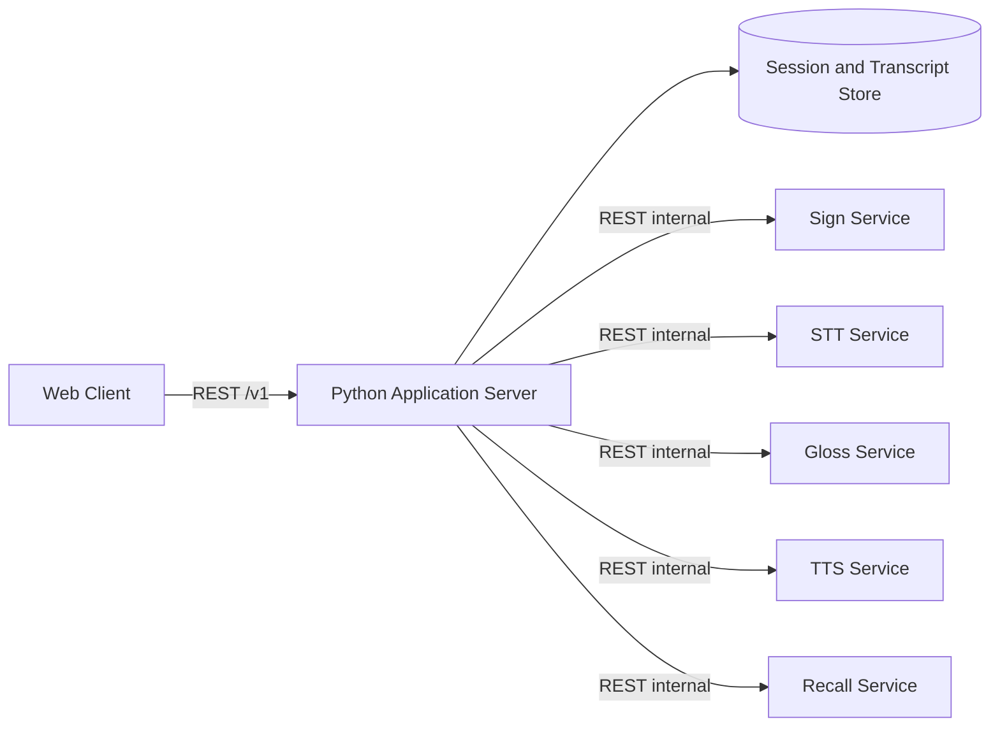

# Isyara Application Server — Design and API Contract

Status: Draft v0.1  
Target: MVP Hackathon IFEST 2026  
Implementasi acuan: Python REST API  
Audience: tim software engineering dan tim AI

## 1. Posisi Dokumen

Dokumen ini merupakan turunan dari `isyara-ai-services-design.md`. Jika terdapat perbedaan:

1. konteks proyek Isyara tetap menjadi sumber keputusan produk;
2. `isyara-ai-services-design.md` menjadi sumber kebenaran batas antarlayanan AI;
3. dokumen ini menjadi sumber kebenaran perilaku Application Server;
4. `isyara-application-server-openapi.yaml` menjadi sumber kebenaran kontrak HTTP publik yang dapat dibaca mesin;
5. `isyara-ai-services-openapi.yaml` menjadi sumber kebenaran kontrak HTTP internal menuju AI services.

Perubahan schema lintas-repo harus memperbarui kedua OpenAPI dalam pull request atau perubahan terkoordinasi yang sama.

## 2. Tanggung Jawab

Application Server adalah orchestration layer antara frontend, penyimpanan session, dan seluruh AI services.

Application Server bertanggung jawab atas:

- lifecycle session;
- lifecycle sign utterance;
- menerima klip sign dan meneruskannya ke Sign Service;
- menyimpan prediction sementara dan token yang dikonfirmasi;
- meneruskan audio chunk ke STT Service;
- menyimpan hanya transcript STT final;
- memfinalisasi sign utterance melalui Gloss Service;
- memanggil TTS untuk teks final/terkonfirmasi;
- memilih bounded transcript context untuk Recall Service;
- memvalidasi referensi evidence Recall sekali lagi;
- normalisasi error, timeout, retry, request ID, dan idempotency;
- mengisolasi kegagalan setiap service.

Application Server tidak bertanggung jawab atas:

- inferensi SignBart;
- inferensi STT/TTS;
- prompt dan inferensi Qwen;
- threshold confidence model;
- akses langsung ke Hugging Face;
- penyimpanan video atau audio mentah secara permanen.

## 3. Arsitektur



Frontend hanya mengenal base URL Application Server. URL service internal, API key internal, model ID, token provider, dan prompt tidak boleh dikirim ke browser.

Kontrak MVP tidak mewajibkan autentikasi pengguna karena targetnya demo lokal. CORS tetap dibatasi ke origin frontend. Autentikasi publik dapat ditambahkan kemudian tanpa mengubah kontrak internal antarlayanan.

## 4. Resource dan State

### 4.1 Session

```text
ACTIVE → ENDED
```

Session menyimpan:

- `sessionId`;
- `status`;
- `language`;
- `createdAt` dan `endedAt`;
- kumpulan transcript entry;
- utterance yang masih aktif atau selesai.

Hanya session `ACTIVE` yang dapat menerima audio, sign prediction, token baru, atau pertanyaan Recall.

### 4.2 Sign utterance

```text
CAPTURING → FINALIZED
     └────→ CANCELLED
```

Aturan:

- maksimum satu utterance `CAPTURING` per session;
- prediction belum menjadi token;
- token hanya dibuat melalui tindakan konfirmasi pengguna;
- utterance tanpa token tidak dapat difinalisasi;
- utterance `FINALIZED` dan `CANCELLED` bersifat immutable;
- finalisasi yang berhasil membuat tepat satu transcript entry `source=sign`.

### 4.3 Prediction

Prediction disimpan sementara agar konfirmasi pengguna dapat diverifikasi.

```text
PENDING_CONFIRMATION → ACCEPTED
                    └→ REJECTED
                    └→ EXPIRED
```

`selectedLabel` harus merupakan label yang terdapat dalam `candidates`. Jika pengguna ingin mengulang sign, prediction lama ditolak dan klip baru dikirim.

### 4.4 Transcript entry

Transcript entry bersifat append-only selama session aktif.

```json
{
  "id": "tr_17",
  "sessionId": "ses_01J8Y6Z4Q1",
  "sequence": 17,
  "source": "speech",
  "speaker": "Participant",
  "text": "The submission deadline is Friday at five PM.",
  "startedAt": "2026-09-18T10:18:11Z",
  "endedAt": "2026-09-18T10:18:14Z",
  "isFinal": true
}
```

Hanya entry `isFinal=true` yang boleh dikirim ke Recall Service.

## 5. Endpoint Publik Frontend

### 5.1 Session

| Method dan path | Fungsi |
|---|---|
| `POST /v1/sessions` | membuat session aktif |
| `GET /v1/sessions/{sessionId}` | membaca status session |
| `DELETE /v1/sessions/{sessionId}` | mengakhiri session dan menghapus data sesuai kebijakan MVP |

### 5.2 Sign-to-Text

| Method dan path | Fungsi |
|---|---|
| `POST /v1/sessions/{sessionId}/utterances` | Start Sign |
| `POST /v1/utterances/{utteranceId}/predictions` | unggah satu klip isolated sign |
| `POST /v1/utterances/{utteranceId}/tokens` | konfirmasi satu candidate sebagai kata |
| `POST /v1/utterances/{utteranceId}:finalize` | Stop Sign dan buat transcript entry |
| `DELETE /v1/utterances/{utteranceId}` | batalkan utterance aktif |

Prediction endpoint menerima `multipart/form-data`:

```text
video: binary
topK: 3
vocabularyVersion: mvp-en-v1
```

Application Server menambahkan `X-Request-ID`, lalu meneruskan payload ke `POST /v1/sign/predict` milik Sign Service. File tidak disimpan setelah request selesai.

Konfirmasi token:

```json
{
  "predictionId": "pred_01J8Y7RK2F",
  "selectedLabel": "REPEAT"
}
```

Response:

```json
{
  "token": {
    "id": "tok_01J8Y7T1Z8",
    "predictionId": "pred_01J8Y7RK2F",
    "label": "REPEAT",
    "position": 2,
    "confirmedAt": "2026-09-18T10:15:23Z"
  },
  "utteranceStatus": "CAPTURING"
}
```

### 5.3 Speech-to-Text

| Method dan path | Fungsi |
|---|---|
| `POST /v1/sessions/{sessionId}/stt/chunks` | mengirim satu audio chunk |

Request multipart membawa:

```text
audio: binary
streamId: stt_01J8Y8B1CA
sequence: 4
commit: false
language: en
encoding: webm
startedAt: 2026-09-18T10:18:11Z
```

Aturan:

- kombinasi `streamId + sequence` unik dan idempotent;
- `commit=false` menghasilkan partial provisional dan tidak membuat transcript entry;
- `commit=true` menghasilkan final, melakukan deduplikasi overlap, lalu membuat transcript entry;
- sequence yang lebih lama tidak boleh menimpa revision yang lebih baru;
- detail buffering dan model dimiliki tim STT.

### 5.4 TTS

| Method dan path | Fungsi |
|---|---|
| `POST /v1/utterances/{utteranceId}:speak` | membuat audio dari utterance sign final |

Application Server mengambil teks final dari store; frontend tidak mengirim teks bebas pada endpoint ini. Hal ini mencegah prediction ambigu dibacakan sebelum konfirmasi.

Response berupa `audio/wav` atau `audio/flac`. Jika TTS gagal, transcript tetap tersedia dan response error tidak mengubah status utterance.

### 5.5 Transcript dan Recall

| Method dan path | Fungsi |
|---|---|
| `GET /v1/sessions/{sessionId}/transcript` | membaca transcript final berurutan |
| `POST /v1/sessions/{sessionId}/recall` | mengajukan pertanyaan berbasis transcript |

Frontend mengirim pertanyaan dan opsi rentang, bukan context mentah:

```json
{
  "query": "When is the deadline?",
  "range": {
    "mode": "recent",
    "lastSeconds": 300
  },
  "language": "en"
}
```

Application Server:

1. mengambil transcript final sesuai range;
2. mengurutkan berdasarkan `sequence`;
3. memotong entry tertua jika melewati batas konteks;
4. memanggil Recall Service dengan `contextEntries` eksplisit;
5. memastikan setiap evidence `entryId` ada pada context yang dikirim;
6. mengembalikan jawaban, evidence, dan `grounded` kepada frontend.

Jika context kosong, Application Server langsung mengembalikan `grounded=false` dengan `notFoundReason=EMPTY_CONTEXT` tanpa memanggil Recall Service.

## 6. Pemetaan ke Internal AI Services

| Public operation | Internal call | Data yang disimpan |
|---|---|---|
| unggah klip sign | `POST /v1/sign/predict` | prediction sementara; bukan transcript |
| konfirmasi kata | tidak ada | confirmed token |
| finalisasi utterance | `POST /v1/gloss/normalize` | satu transcript entry `source=sign` |
| kirim audio chunk | `POST /v1/stt/transcriptions` | hanya final transcript entry |
| speak utterance | `POST /v1/tts/synthesize` | tidak menyimpan audio secara default |
| Recall | `POST /v1/recall/query` | opsional: pertanyaan dan jawaban; transcript tidak berubah |

## 7. Fungsi Aplikasi Python

Framework acuan dapat menggunakan FastAPI dan Pydantic, tetapi kontrak HTTP tidak bergantung pada framework tersebut.

```python
async def create_session(command: CreateSession) -> Session: ...

async def create_sign_utterance(
    session_id: str,
    command: CreateUtterance,
) -> SignUtterance: ...

async def request_sign_prediction(
    utterance_id: str,
    video: UploadFile,
    options: SignPredictionOptions,
) -> SignPrediction: ...

async def confirm_sign_token(
    utterance_id: str,
    command: ConfirmSignToken,
) -> ConfirmedSignToken: ...

async def finalize_sign_utterance(
    utterance_id: str,
) -> FinalizedUtterance: ...

async def transcribe_stt_chunk(
    session_id: str,
    audio: UploadFile,
    command: STTChunkCommand,
) -> STTChunkResult: ...

async def synthesize_utterance(
    utterance_id: str,
) -> AudioStream: ...

async def answer_session_recall(
    session_id: str,
    command: RecallCommand,
) -> RecallAnswer: ...
```

Internal clients:

```python
class SignServiceClient(Protocol):
    async def predict(self, video: UploadFile, options: SignOptions) -> SignPrediction: ...

class STTServiceClient(Protocol):
    async def transcribe(self, audio: UploadFile, options: STTOptions) -> Transcript: ...

class GlossServiceClient(Protocol):
    async def normalize(self, tokens: list[ConfirmedSignToken]) -> NormalizedUtterance: ...

class TTSServiceClient(Protocol):
    async def synthesize(self, text: str, options: TTSOptions) -> AudioStream: ...

class RecallServiceClient(Protocol):
    async def query(self, query: str, context: list[TranscriptEntry]) -> RecallAnswer: ...
```

## 8. Persistence MVP

Pilihan acuan: SQLite untuk demo lokal atau PostgreSQL jika deployment bersama sudah tersedia. Domain model tidak boleh bergantung pada vendor database.

Tabel/collection minimum:

- `sessions`;
- `sign_utterances`;
- `sign_predictions`;
- `confirmed_sign_tokens`;
- `transcript_entries`;
- `idempotency_records`.

Audio dan video hanya hidup selama request berlangsung. Jika debugging media diaktifkan, gunakan direktori sementara, TTL singkat, dan feature flag yang default-nya `false`.

## 9. Transaksi dan Idempotency

- `POST /sessions`, prediction, token confirmation, finalization, TTS, dan Recall menerima `Idempotency-Key`.
- Request dengan key dan payload yang sama mengembalikan hasil sebelumnya.
- Key yang sama dengan payload berbeda menghasilkan `409 IDEMPOTENCY_CONFLICT`.
- Finalisasi utterance dan pembuatan transcript entry berlangsung dalam satu transaksi.
- Jika Gloss Service berhasil tetapi commit database gagal, retry finalisasi tidak boleh membuat entry ganda.
- `sequence` transcript dialokasikan oleh Application Server, bukan AI service.

## 10. Timeout dan Retry

| Internal call | Timeout total | Retry |
|---|---:|---:|
| Sign prediction | 3 detik | 0 |
| STT partial | 6 detik | 0 |
| STT final | 10 detik | 1 |
| Gloss template | 1 detik | 0 |
| TTS | 12 detik | 1 |
| Recall | 15 detik | 1 |

Retry hanya untuk timeout, `429`, dan `5xx` yang dinyatakan retryable. Jangan retry validation error atau prediction sign karena retry inferensi klip yang sama tidak memberikan informasi baru.

## 11. Error Publik

```json
{
  "error": {
    "code": "SIGN_SERVICE_UNAVAILABLE",
    "message": "Sign recognition is temporarily unavailable.",
    "retryable": true,
    "requestId": "c946f42d-474e-40f4-a6d9-b0eb75f05a9a",
    "details": {}
  }
}
```

Application Server tidak membocorkan nama provider, stack trace, URL internal, atau credential. Error internal dinormalisasi:

| Internal condition | Public code |
|---|---|
| Sign Service timeout/503 | `SIGN_SERVICE_UNAVAILABLE` |
| STT timeout/503 | `STT_SERVICE_UNAVAILABLE` |
| TTS timeout/503 | `TTS_SERVICE_UNAVAILABLE` |
| Recall timeout/503 | `RECALL_SERVICE_UNAVAILABLE` |
| prediction ID tidak dikenal/kedaluwarsa | `PREDICTION_NOT_AVAILABLE` |
| utterance sudah final | `UTTERANCE_ALREADY_FINALIZED` |
| session sudah berakhir | `SESSION_ENDED` |

## 12. Environment Variables

```dotenv
APP_HOST=0.0.0.0
APP_PORT=8000
DATABASE_URL=sqlite:///./isyara.db
CORS_ALLOWED_ORIGINS=http://localhost:5173
MAX_SIGN_CLIP_BYTES=10000000
MAX_AUDIO_CHUNK_BYTES=10000000
RECALL_MAX_CONTEXT_CHARS=24000

SIGN_SERVICE_URL=http://127.0.0.1:8765
STT_SERVICE_URL=http://127.0.0.1:8001
GLOSS_SERVICE_URL=http://127.0.0.1:8002
TTS_SERVICE_URL=http://127.0.0.1:8003
RECALL_SERVICE_URL=http://127.0.0.1:8004
INTERNAL_API_KEY=
```

Service URL harus dapat berbeda tanpa mengubah route publik.

## 13. Health dan Degraded Mode

```text
GET /health/live
GET /health/ready
```

Readiness Application Server menampilkan status dependency tanpa credential:

```json
{
  "status": "degraded",
  "service": "application-api",
  "dependencies": {
    "database": "ready",
    "sign": "ready",
    "stt": "unavailable",
    "tts": "ready",
    "gloss": "ready",
    "recall": "ready"
  }
}
```

`degraded` tetap dapat mengembalikan HTTP `200` untuk demo jika core page dan sebagian fitur dapat digunakan. `503` hanya ketika database atau dependency yang ditetapkan sebagai wajib tidak siap.

## 14. Observability

Setiap request publik memperoleh `X-Request-ID`; ID yang sama diteruskan ke service internal. Catat:

- route dan status;
- latency total;
- latency setiap dependency;
- ukuran payload;
- session ID dan utterance ID yang telah di-hash atau diperlakukan sebagai identifier teknis;
- error code terstandardisasi.

Jangan catat media mentah, secret, atau transcript lengkap secara default.

## 15. Acceptance Criteria

- Frontend hanya memanggil Application Server.
- Application Server dapat dijalankan dengan mock AI clients berdasarkan kedua OpenAPI.
- Satu klip sign menghasilkan satu prediction dan tidak langsung menjadi transcript.
- Hanya candidate yang dikonfirmasi yang menjadi token.
- Finalisasi sign menghasilkan tepat satu transcript entry.
- Partial STT tidak disimpan.
- Recall hanya menerima transcript final yang dipilih Application Server.
- Evidence Recall divalidasi terhadap context yang benar-benar dikirim.
- Kegagalan STT/TTS/Recall tidak menghapus session atau transcript.
- URL dan credential internal tidak muncul pada response frontend.

## 16. Pengujian Kontrak Minimum

1. Buat session → buat utterance → predict → confirm → finalize → transcript berisi satu entry sign.
2. Prediction ambigu tidak masuk transcript sebelum konfirmasi.
3. Prediction yang ditolak tidak dapat dikonfirmasi kembali.
4. Partial STT tidak menambah transcript; commit menambah tepat satu entry.
5. TTS gagal, tetapi utterance final dan transcript tetap ada.
6. Recall tidak menemukan jawaban dan mengembalikan `grounded=false`.
7. Retry dengan `Idempotency-Key` yang sama tidak membuat data ganda.
8. Sign Service mati dan hanya fitur sign yang menampilkan error terisolasi.
