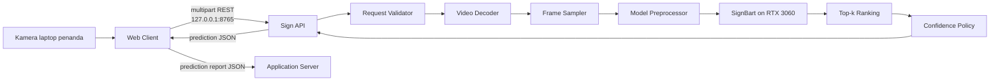

# Isyara Sign Language Service — Design Specification

Status: Final v1.1
Target: MVP Hackathon IFEST 2026
Pemilik: tim Sign Language Recognition
Runtime target: laptop dengan NVIDIA RTX 3060
Bahasa/vocabulary awal: Inggris, 10–20 isolated signs

## 1. Posisi Dokumen

Dokumen ini merupakan spesifikasi implementasi khusus Sign Language Service dan harus dibaca bersama design Application Server serta AI Services versi terbaru.

Ketentuan integrasi yang diwarisi:

- web client pada laptop penanda memanggil Sign Language Service melalui REST loopback;
- Application Server tidak memanggil Sign Language Service dan tidak menerima video sign;
- satu request prediksi merepresentasikan satu klip isolated sign;
- Sign Language Service tidak menyimpan session, utterance, token, atau transcript;
- web client melaporkan prediction ke Application Server;
- prediction baru menjadi token setelah dikonfirmasi melalui Application Server;
- hanya token terkonfirmasi yang dapat diteruskan ke Gloss, TTS, atau Recall.

Kontrak HTTP yang dapat dibaca mesin tersedia di `isyara-sign-language-service-openapi.yaml`.

## 2. Tujuan

Sign Language Service menerima satu klip video pendek, menjalankan preprocessing dan inferensi SignBart, lalu mengembalikan:

- kandidat label teratas;
- confidence setiap kandidat;
- status confidence-aware;
- keputusan apakah disambiguasi pengguna diperlukan;
- versi model dan vocabulary;
- latency inferensi.

Service dioptimalkan untuk demo yang stabil dan dapat diulang, bukan untuk continuous sign language translation.

## 3. Ruang Lingkup

### 3.1 Termasuk

- validasi file video;
- decoding video;
- sampling frame sesuai kebutuhan checkpoint;
- preprocessing input model;
- inferensi SignBart pada GPU;
- top-k prediction;
- confidence policy;
- deteksi input tidak valid, tidak dikenal, atau tidak berisi sign;
- endpoint health dan readiness;
- observability tanpa menyimpan media mentah.

### 3.2 Tidak termasuk

- akses kamera browser;
- pemotongan continuous signing otomatis;
- penyimpanan video;
- pengelolaan session dan utterance;
- konfirmasi pengguna;
- pembentukan kalimat dari beberapa kata;
- STT, TTS, Gloss, atau Conversation Recall;
- terjemahan BISINDO penuh;
- personal adaptation.

## 4. Arsitektur Internal



Komponen API tidak mengetahui session, utterance, atau struktur database Application Server. Semua dependency model dimuat melalui configuration layer. Video hanya bergerak dari browser ke loopback pada laptop penanda.

## 5. Kontrak Input

Endpoint:

```http
POST /v1/sign/predict
Content-Type: multipart/form-data
```

Fields:

| Field | Tipe | Wajib | Aturan |
|---|---|:---:|---|
| `video` | binary | ya | satu klip yang berisi satu isolated sign |
| `topK` | integer | ya | `1–5`, default `3` |
| `vocabularyVersion` | string | ya | harus sama dengan vocabulary yang dimuat |

Header:

| Header | Wajib | Keterangan |
|---|:---:|---|
| `X-Request-ID` | ya | UUID dari web client untuk korelasi log lokal |
| `X-Internal-API-Key` | tidak pada mode browser lokal | opsional untuk deployment private service-to-service; jangan ditanam dalam frontend |

Service wajib bind ke `127.0.0.1` pada mode demo. CORS hanya mengizinkan origin web app yang dikonfigurasi secara eksplisit. Preflight `OPTIONS` harus mendukung `Content-Type` dan `X-Request-ID`; dukungan Private Network Access harus diuji pada browser demo. Jangan menggunakan wildcard origin bersama credential.

Batas input default:

- container: WebM atau MP4;
- content type: `video/webm` atau `video/mp4`;
- ukuran maksimum: 10 MB;
- durasi yang disarankan: 1–2 detik;
- durasi maksimum: 3 detik;
- tepat satu sign per klip;
- tidak ada asumsi bahwa frame rate sumber selalu sama.

Nilai batas dapat diubah melalui environment variable tanpa mengubah schema API. Sebelum tombol Start Sign diaktifkan, web client memanggil `GET /health/ready` pada origin loopback.

## 6. Alur Prediksi

```text
1. Validasi header, ukuran, content type, topK, dan vocabularyVersion.
2. Decode video menjadi rangkaian frame.
3. Tolak input jika tidak ada frame yang dapat dibaca.
4. Ambil frame secara uniform sesuai jumlah frame yang dibutuhkan checkpoint.
5. Jalankan transformasi visual yang terikat pada modelVersion.
6. Pindahkan tensor ke GPU.
7. Jalankan inferensi tanpa gradient.
8. Ubah logits menjadi probability dan ambil top-k.
9. Terapkan confidence policy.
10. Kembalikan hasil terstruktur dan latency.
11. Lepaskan referensi buffer request; jangan simpan video.
```

Jumlah frame, resolusi, normalisasi, dan urutan channel tidak ditetapkan sebagai konstanta lintas model. Nilai tersebut harus berasal dari model configuration/checkpoint agar pergantian checkpoint tidak memerlukan perubahan route.

## 7. Confidence Policy

Confidence policy dipisahkan dari implementasi SignBart. Input policy:

- `top1Confidence`;
- `top2Confidence`;
- `margin = top1Confidence - top2Confidence`;
- hasil pemeriksaan kualitas input atau no-sign detector, jika tersedia.

Urutan keputusan:

```text
video tidak dapat diproses               → INVALID_INPUT
tidak ada sign yang layak diprediksi     → NO_SIGN
top1 < UNKNOWN_THRESHOLD                 → UNKNOWN
top1 ≥ CONFIDENT_THRESHOLD
dan margin ≥ MIN_TOP1_TOP2_MARGIN        → CONFIDENT
selain itu                               → AMBIGUOUS
```

Threshold tidak menjadi bagian permanen API. Nilainya ditentukan dari validation set dan dimuat dari konfigurasi.

Makna status:

| Status | Makna | Kandidat | Perilaku UI yang diharapkan |
|---|---|---:|---|
| `CONFIDENT` | kandidat utama melewati policy | ada | tampilkan kandidat utama; Application Server dapat menerima aksi konfirmasi |
| `AMBIGUOUS` | dua atau lebih kandidat sulit dibedakan | ada | pengguna memilih salah satu kandidat atau mengulang sign |
| `UNKNOWN` | confidence tidak cukup untuk vocabulary | opsional | minta pengguna mengulang atau membatalkan |
| `NO_SIGN` | klip tidak menunjukkan sign yang didukung | kosong/opsional | jangan membuat token |
| `INVALID_INPUT` | klip dapat diterima HTTP, tetapi tidak dapat dipakai model | kosong | tampilkan panduan rekam ulang |

`requiresConfirmation=true` berarti UI wajib melakukan disambiguasi. Terlepas dari nilai field tersebut, Sign Language Service tidak pernah membuat token atau transcript secara langsung.

## 8. Kontrak Output

Response sukses secara teknis menggunakan HTTP `200`, termasuk hasil `UNKNOWN`, `NO_SIGN`, dan `INVALID_INPUT` yang terdeteksi setelah decoding.

```json
{
  "requestId": "c946f42d-474e-40f4-a6d9-b0eb75f05a9a",
  "predictionId": "pred_01J8Y7RK2F",
  "prediction": "REPEAT",
  "confidence": 0.86,
  "candidates": [
    {"label": "REPEAT", "confidence": 0.86},
    {"label": "AGAIN", "confidence": 0.09},
    {"label": "UNDERSTAND", "confidence": 0.03}
  ],
  "status": "CONFIDENT",
  "requiresConfirmation": false,
  "modelVersion": "signbart-mvp-v1",
  "vocabularyVersion": "mvp-en-v1",
  "latencyMs": 184
}
```

Aturan:

- `predictionId` unik untuk setiap hasil inferensi;
- `prediction` sama dengan candidate pertama untuk `CONFIDENT` atau `AMBIGUOUS`;
- `prediction` dapat `null` untuk `UNKNOWN`, `NO_SIGN`, atau `INVALID_INPUT`;
- `confidence` selalu berada pada rentang `0–1`;
- `candidates` diurutkan dari confidence tertinggi;
- panjang `candidates` tidak melebihi `topK`;
- `latencyMs` mengukur proses di Sign Language Service, tidak termasuk jaringan dan Application Server.

Web client meneruskan isi prediction yang relevan ke Application Server sebagai JSON dan mengganti nama `requestId` lokal menjadi `localRequestId`. Application Server memberikan `X-Request-ID` publiknya sendiri. Sign Language Service tidak memanggil Application Server.

## 9. Fungsi Inti

```python
async def predict_sign(
    video: bytes,
    *,
    content_type: str,
    top_k: int,
    vocabulary_version: str,
    request_id: UUID,
) -> SignPredictionResult: ...

def validate_video_request(
    video: bytes,
    content_type: str,
    limits: VideoLimits,
) -> None: ...

def decode_video(video: bytes) -> DecodedVideo: ...

def sample_frames(
    frames: list[Frame],
    required_frames: int,
) -> list[Frame]: ...

def preprocess_frames(
    frames: list[Frame],
    model_config: ModelInputConfig,
) -> Tensor: ...

def run_inference(
    inputs: Tensor,
    model: SignRecognitionModel,
) -> list[float]: ...

def rank_candidates(
    probabilities: list[float],
    vocabulary: Vocabulary,
    top_k: int,
) -> list[Candidate]: ...

def classify_prediction(
    candidates: list[Candidate],
    quality: InputQuality,
    policy: ConfidencePolicy,
) -> PredictionDecision: ...
```

Model adapter:

```python
class SignRecognitionModel(Protocol):
    model_version: str
    input_config: ModelInputConfig

    def load(self, checkpoint_path: Path, device: str) -> None: ...
    def warmup(self) -> None: ...
    def predict_logits(self, inputs: Tensor) -> Tensor: ...
```

## 10. Lifecycle Model dan GPU

- Model dimuat sekali pada startup.
- Readiness bernilai `not_ready` sampai checkpoint, vocabulary, dan warm-up berhasil.
- Inferensi menggunakan `torch.inference_mode()` atau mekanisme setara.
- Gunakan FP16 hanya setelah hasilnya dibandingkan dengan FP32 dan tidak merusak akurasi demo.
- Default concurrency GPU adalah satu request.
- Request tambahan menunggu antrean pendek atau menerima `429` jika antrean penuh.
- Jangan memuat ulang checkpoint pada setiap request.
- Jangan menjalankan training di proses serving.

Target latency awal:

| Tahap | Target p95 setelah request diterima |
|---|---:|
| validasi dan decoding | < 250 ms |
| preprocessing | < 100 ms |
| inferensi GPU | < 500 ms |
| policy dan serialisasi | < 50 ms |
| total service | < 1 detik |

Target tersebut harus diukur pada laptop demo. Nilai aktual dicatat pada laporan evaluasi dan tidak diklaim sebelum benchmark dijalankan.

## 11. Error Contract

Error transport atau request malformed menggunakan HTTP non-2xx:

```json
{
  "error": {
    "code": "UNSUPPORTED_MEDIA_TYPE",
    "message": "Only video/webm and video/mp4 are supported.",
    "retryable": false,
    "requestId": "c946f42d-474e-40f4-a6d9-b0eb75f05a9a",
    "details": {}
  }
}
```

| HTTP | Code | Retry | Kondisi |
|---:|---|:---:|---|
| 400 | `INVALID_REQUEST` | tidak | field atau header tidak valid |
| 401 | `UNAUTHORIZED` | tidak | internal API key tidak valid |
| 413 | `PAYLOAD_TOO_LARGE` | tidak | klip melebihi batas |
| 415 | `UNSUPPORTED_MEDIA_TYPE` | tidak | format tidak didukung |
| 422 | `VOCABULARY_VERSION_MISMATCH` | tidak | versi vocabulary berbeda |
| 429 | `INFERENCE_BUSY` | ya | antrean GPU penuh |
| 500 | `INFERENCE_FAILED` | bergantung kondisi | inferensi gagal secara tak terduga |
| 503 | `MODEL_NOT_READY` | ya | model/checkpoint belum siap |
| 504 | `INFERENCE_TIMEOUT` | ya | inferensi melewati deadline |

Perbedaan penting: video yang lolos transport tetapi buruk untuk prediksi menghasilkan HTTP `200` dengan status `INVALID_INPUT`; payload yang tidak memenuhi kontrak menghasilkan HTTP error.

## 12. Health dan Readiness

```http
GET /health/live
GET /health/ready
```

`live` memeriksa proses. `ready` memeriksa:

- checkpoint ditemukan dan berhasil dimuat;
- GPU/device tersedia;
- vocabulary berhasil dimuat;
- jumlah output model sama dengan jumlah label;
- warm-up berhasil;
- versi model dan vocabulary terdefinisi.

Contoh:

```json
{
  "status": "ready",
  "service": "sign-language",
  "checks": {
    "model": "ready",
    "device": "cuda:0",
    "vocabulary": "mvp-en-v1"
  }
}
```

## 13. Konfigurasi

```dotenv
SIGN_HOST=127.0.0.1
SIGN_PORT=8765
INTERNAL_API_KEY=
SIGN_ALLOWED_ORIGINS=http://localhost:5173,http://APP_SERVER_HOST:8000
SIGN_ALLOW_PRIVATE_NETWORK=true

SIGN_MODEL_PATH=./models/signbart-mvp-v1
SIGN_MODEL_VERSION=signbart-mvp-v1
SIGN_VOCABULARY_PATH=./config/mvp-en-v1.json
SIGN_VOCABULARY_VERSION=mvp-en-v1
SIGN_DEVICE=cuda:0
SIGN_USE_FP16=false

SIGN_MAX_CLIP_BYTES=10000000
SIGN_MAX_CLIP_DURATION_MS=3000
SIGN_MAX_CONCURRENCY=1
SIGN_QUEUE_SIZE=2
SIGN_INFERENCE_TIMEOUT_MS=2000

SIGN_CONFIDENT_THRESHOLD=
SIGN_UNKNOWN_THRESHOLD=
SIGN_MIN_TOP1_TOP2_MARGIN=
SIGN_STORE_DEBUG_MEDIA=false
```

Threshold kosong harus membuat readiness gagal. Nilainya wajib berasal dari evaluasi checkpoint, bukan tebakan di route handler.

`SIGN_ALLOW_PRIVATE_NETWORK` hanya diaktifkan untuk origin demo yang telah diuji. Jika web app disajikan melalui HTTPS dan browser menolak akses ke service HTTP loopback, gunakan companion service dengan HTTPS lokal atau ekstensi browser; solusi tersebut berada di luar kontrak MVP. Untuk demo, gunakan origin HTTP pada jaringan tepercaya atau kombinasi origin/browser yang telah lolos smoke test.

## 14. Vocabulary Contract

File vocabulary bersifat versioned dan immutable untuk satu versi model deployment.

```json
{
  "version": "mvp-en-v1",
  "modelVersion": "signbart-mvp-v1",
  "labels": [
    {"index": 0, "label": "REPEAT", "displayText": "Repeat"},
    {"index": 1, "label": "AGAIN", "displayText": "Again"}
  ]
}
```

Aturan:

- indeks harus unik dan berurutan;
- label API menggunakan identifier stabil berhuruf kapital dan underscore;
- `displayText` bukan bagian input model;
- jumlah label harus sama dengan dimensi logits;
- perubahan urutan atau isi label memerlukan `vocabularyVersion` baru.

## 15. Struktur Repository

```text
sign-language-service/
├─ contracts/
│  └─ openapi.yaml
├─ config/
│  └─ mvp-en-v1.json
├─ models/
│  └─ README.md
├─ src/
│  ├─ main.py
│  ├─ api.py
│  ├─ config.py
│  ├─ schemas.py
│  ├─ video.py
│  ├─ preprocessing.py
│  ├─ inference.py
│  ├─ confidence.py
│  └─ errors.py
├─ tests/
│  ├─ contract/
│  ├─ unit/
│  └─ smoke/
├─ .env.example
└─ README.md
```

Checkpoint besar tidak perlu disimpan di Git. README model mencatat sumber, checksum, lisensi, dan cara memperoleh checkpoint.

## 16. Observability dan Privasi

Log per request:

- `requestId`;
- `predictionId`;
- status HTTP dan prediction status;
- model/vocabulary version;
- ukuran dan durasi video;
- latency decoding, preprocessing, inference, dan total;
- device dan queue wait time;
- error code.

Jangan log:

- binary video;
- frame hasil decode;
- internal API key;
- path lokal yang sensitif;
- isi media pengguna.

`SIGN_STORE_DEBUG_MEDIA` harus `false` secara default. Jika diaktifkan untuk debugging, gunakan direktori sementara dan hapus otomatis dengan TTL singkat.

## 17. Pengujian

### 17.1 Unit

- uniform frame sampling pada klip pendek dan panjang;
- mapping indeks logits ke label;
- urutan top-k;
- seluruh cabang confidence policy;
- vocabulary mismatch;
- ukuran dan content type invalid.

### 17.2 Contract

- response sesuai `isyara-sign-language-service-openapi.yaml`;
- `requestId` dipantulkan;
- `prediction=null` valid untuk status nonprediction;
- confidence selalu `0–1`;
- kandidat terurut menurun;
- error menggunakan envelope yang sama.
- preflight CORS hanya menerima origin yang ada dalam allowlist.

### 17.3 Smoke

- service startup dan warm-up pada RTX 3060;
- satu klip valid menghasilkan response;
- klip kosong ditolak;
- no-sign menghasilkan `NO_SIGN` atau `UNKNOWN`, bukan token;
- sepuluh request berurutan tidak meningkatkan penggunaan VRAM secara terus-menerus;
- web client dapat memanggil service melalui `127.0.0.1:8765` dan melaporkan response ke Application Server.
- laptop kedua yang tidak menjalankan Sign Language Service tetap dapat menggunakan Application Server.

### 17.4 Evaluasi model

Laporkan minimal:

- jumlah class dan data per class;
- Macro F1;
- top-1 dan top-3 accuracy;
- confusion matrix;
- unknown/no-sign rejection;
- distribusi top-1 confidence dan margin;
- latency p50/p95;
- hasil pada variasi pencahayaan, jarak, dan pengguna.

Frame dari video yang sama tidak boleh tersebar ke train dan test split.

## 18. Acceptance Criteria

- Service berjalan pada laptop RTX 3060 dengan satu perintah yang didokumentasikan.
- Service hanya terekspos melalui loopback pada mode demo.
- Model dimuat dan di-warm-up saat startup.
- `POST /v1/sign/predict` menerima satu klip dan mengembalikan schema final.
- Satu request tidak membuat session atau transcript.
- `AMBIGUOUS`, `UNKNOWN`, `NO_SIGN`, dan `INVALID_INPUT` dapat dibedakan.
- Vocabulary mismatch ditolak secara eksplisit.
- Video tidak disimpan secara default.
- Response p95 setelah upload selesai ditargetkan kurang dari satu detik dan diukur pada perangkat demo.
- Semua contract, unit, dan smoke test lulus.
- Smoke test end-to-end membuktikan bahwa video tidak mencapai Application Server.
- Known limitations ditulis di README tanpa klaim continuous sign translation.

## 19. Urutan Implementasi

1. Bekukan vocabulary dan mapping label-index.
2. Implementasikan loader checkpoint dan model adapter.
3. Implementasikan decode, sampling, dan preprocessing sesuai checkpoint.
4. Implementasikan endpoint mock sesuai OpenAPI.
5. Hubungkan inferensi GPU dan warm-up.
6. Kalibrasi confidence policy dari validation set.
7. Tambahkan error handling, metrics, dan privacy guard.
8. Jalankan contract test dengan mock web client dan mock Application Server penerima prediction report.
9. Benchmark latency dan VRAM pada laptop demo.
10. Bekukan checkpoint, threshold, dan vocabulary untuk demo.
